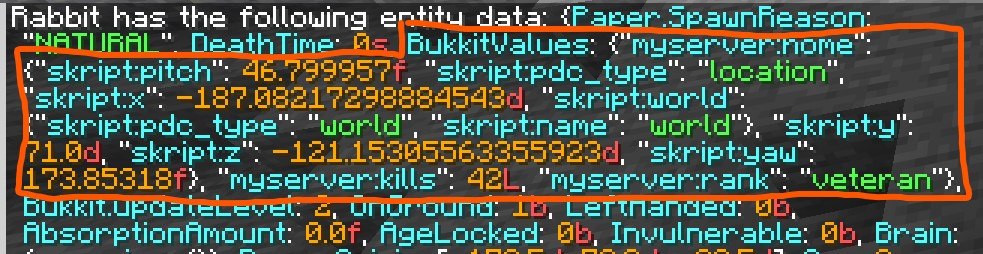

Persistent data tags (also called PDC, short for persistent data container) are a way to store custom data directly on players, entities, items, blocks, chunks, and worlds. Unlike variables, which are stored separately from the game itself, persistent data tags are a part of the object they're attached to. 

:::note
Persistent data tags require Skript 2.15 or higher.
:::

## What are Persistent Data Tags?

Think of persistent data tags as sticky notes attached directly to a game object. Stick a number on a sword, and that sword will always carry that number. Even if you move it between inventories, drop it on the ground, or pick it back up, it will always have the number available. This makes PDC tags specifically useful for item data, since items generally do not have unique identifiers you can use to access data in traditional Skript variables.

Here are some things you might use persistent data tags for:

- Custom item stats, like damage bonuses or charge levels
- Marking entities as part of a custom mob AI system
- Storing flags on chunks or worlds for game state

:::note
Notably, PDC tags are ***NOT NBT tags***, despite them showing up when you look at the NBT of something. When you read or write NBT data, it's a separate representation of the item/entity/object that's generated on the fly. This means setting NBT values means all the changed nbt has to be re-written back into the original object, which can get very expensive! 

PDC tags end up being saved in NBT format, but reading and writing them does not involve the same re-writing editing NBT causes. The PDC tags are part of the object and can be changed individually, like setting the name of an entity or the lore of an item. 
:::

:::caution
PDC tags are also ***NOT metadata tags***. They serve a very similar role, though, with the main difference being their abililty to be stored over server restarts and be attached to a specific entity/object. Paper is in the process of deprecating and removing metadata tags, so **we highly suggest switching your metadata tags to PDC tags instead**. It is unknown how long metadata tags will continue to stick around.
:::


## Keys

Every persistent data tag needs a name, called a **key**. Keys follow a **namespaced format**:

```
namespace:key-name
```

Both the namespace and key name can only contain lowercase letters (`a-z`), digits (`0-9`), underscores (`_`), hyphens (`-`), periods (`.`), and forward slashes (`/`).
Uppercase letters will be automatically converted to lowercase for you.

```applescript
"myserver:custom_damage"   # good
"acmeplugin:jump/boost"    # good
"MY-KEY"                   # ok, uppercase not allowed but automatically converted for you
"hello world"              # bad, spaces not allowed
```

:::caution
If you don't provide a namespace, the key defaults to `minecraft`. We advise using a specific namespace to avoid colliding with PDC from other scripts, but it is not required.

```applescript
# ok, stored as "minecraft:damage_bonus"
set data tag "damage_bonus" of player's tool to 10

# better, stored as "myserver:damage_bonus"
set data tag "myserver:damage_bonus" of player's tool to 10
```
:::

## Getting and Setting Tags

The core syntax is `the data tag "test" of {something}`:
```applescript
[the] [persistent] [%-*classinfo%] [:list] data (value|tag) %string% of %objects%
%objects%'[s] [persistent] [%-*classinfo%] data (value|tag) %string%
```
Some basic uses of the singular form:
```applescript
# setting a tag
set data tag "myserver:level" of player to 5

# getting a tag
set {_level} to data tag "myserver:level" of player

# checking if a tag exists
if data tag "myserver:level" of player is set:
    send "Your level is %{_level}%!" to player

# deleting a tag
delete data tag "myserver:level" of player
```

You can also use the possessive form:

```applescript
set {_level} to player's data tag "myserver:level"
```

Here's a simple example of storing a damage bonus on a sword:

```applescript
command /enchant-sword:
    trigger:
        set data tag "myserver:damage_bonus" of player's tool to 10
        send "Your sword has been enchanted with a damage bonus!"

on damage:
    set {_bonus} to data tag "myserver:damage_bonus" of attacker's tool
    if {_bonus} is set:
        add {_bonus} to damage
```

## Specifying Types

By default, Skript figures out the type of a tag automatically. When writing a tag, it infers the type from the value. When reading a tag, it tries each compatible type until it finds one that matches.

For most use cases, this works fine without any extra effort:

```applescript
set data tag "myserver:kills" of player to 42
set {_kills} to data tag "myserver:kills" of player
```

However, you can add a **specific type** before `data tag` to be explicit:

```applescript
set {_kills} to number data tag "myserver:kills" of player
```

When a specific type is provided, Skript will only return a value if the stored tag matches that exact type, otherwise it returns nothing. This is most useful when you want to safely distinguish between different stored types, or if you want Skript to know for certain what type the tag will be returning.

```applescript
on shoot:
    # only read the tag if it's actually a number
    set {_strength} to number data tag "myserver:strength" of shooter's tool
    if {_strength} is set:
        set number data tag "myserver:damage" of projectile to {_strength}

on damage:
    set {_damage} to number data tag "myserver:damage" of projectile
    if {_damage} is set:
        set damage to {_damage}
```

## Storing Lists

You can store a list of values using the `list` modifier before `data tag`:

```applescript
# store a list
set list data tag "myserver:pets" of player to {pets::%uuid of player%::*}

# retrieve a list
set {_pets::*} to list data tag "myserver:pets" of player
```

The `list` modifier can be combined with a specified type:

```applescript
set {_scores::*} to number list data tag "myserver:scores" of player
```

You can also omit `list` and instead make the specified type plural:
```applescript
set {_scores::*} to numbers data tag "myserver:scores" of player
```

:::caution
Unlike traditional NBT syntaxes like SkBee's, persistent data tags cannot be nested at this time. Each key stores a single flat value or list. There is no compound tag support. If you need deeply structured data, consider using multiple flat tags or Skript variables instead.
:::

## Supported Types

PDC natively handles numbers and text. Beyond that, any Skript type that can be saved in a variable can also be stored in a persistent data tag, so, locations, items, offline players, and more are all valid types. Transient types like inventories, entities, and similar are not valid.

```applescript
# numbers
set data tag "myserver:kills" of player to 42

# text
set data tag "myserver:rank" of player to "veteran"

# items
set data tag "myserver:reward-item" of player to a diamond sword named "Prize"

# offline players (e.g. storing who created a mob)
set data tag "myserver:owner" of last spawned entity to player
```

## Full Example

Here's a complete script using persistent data tags to implement a jump-boost item:

```applescript
# Give the player the boots
command /give-springboots:
    trigger:
        give player leather boots named "Spring Boots"
        set data tag "myserver:spring_boost" of player's tool to true
        send "Equip these boots and jump to launch yourself upward!"

# Apply the boost on jump
on jump:
    if data tag "myserver:spring_boost" of player's boots is set:
        push player upwards with force 1.5
```

And a slightly more involved example — a custom bow that deals bonus damage based on a tag set on the bow:

```applescript
# Give the player a bow with extra damage
command /give-powerbow:
    trigger:
        set {_bow} to bow named "&6Power Bow" with lore "&4This bow fires arrows that deal serious damage."
        set number data tag "myserver:arrow_damage" of {_bow} to 8
        give {_bow} to player

# When the player shoots, copy the damage tag onto the arrow
on shoot:
    set {_bonus} to number data tag "myserver:arrow_damage" of shooter's tool
    if {_bonus} is set:
        set number data tag "myserver:arrow_damage" of projectile to {_bonus}

# When the arrow hits, apply the bonus damage
on damage:
    if victim is a living entity:
        set {_bonus} to number data tag "myserver:arrow_damage" of projectile
        if {_bonus} is set:
            add {_bonus} to damage
```

## Viewing Tags with `/data`

Persistent data tags show up in Minecraft's `/data` command, which is useful for debugging.

### Entities and Players
Run `/data get entity <player-name>` and look for `BukkitValues`:

```
/data get entity Steve
```


Simple types like numbers and strings appear directly under `BukkitValues`:

```
{BukkitValues: {"myserver:kills": 42L, "myserver:rank": "veteran"}}
```

### Items
for the item currently in your hand:

```
/data get entity @s SelectedItem
```

Items store their PDC inside a `minecraft:custom_data` component, which holds a `PublicBukkitValues` compound:

```
{id: "minecraft:diamond_sword", components: {"minecraft:custom_data": {PublicBukkitValues: {"myserver:damage_bonus": 10}}}}
```


### Blocks
PDC is only valid for blocks that are block entities, like chests, signs, and similar blocks. For more inert blocks, we advise storing data on the chunk instead.


### Chunks, Worlds, and others:
Other PDC holders will generally fall into the same format as blocks. Though `/data` cannot show the data of chunks or worlds, viewing their NBT with other tools will show a similar format.

:::note
Complex types like offline players or locations are stored as nested compounds inside `PublicBukkitValues`. Skript uses these to reconstruct the original object when you read the tag back. It's not necessary to understand the full format, but take note of the `skript:type` tag, as it shows you what type of data Skript has stored. The following tags may be legible or they may be a long string of random letters and numbers. It depends on how easy it is to store that specific type of data. We have attempted to make it as legible as possible.

```
{"myserver:owner": {"skript:type": "offlineplayer", "skript:uuid": {...}}}
```
:::